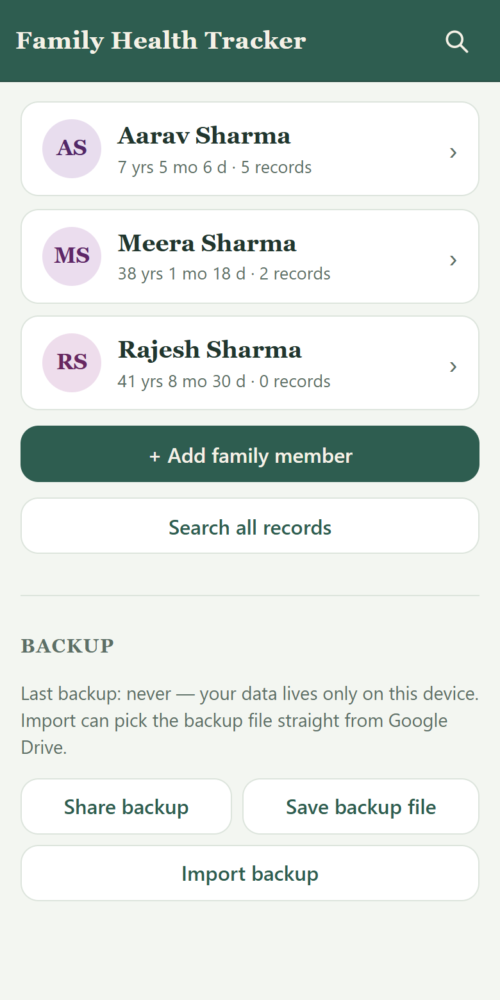
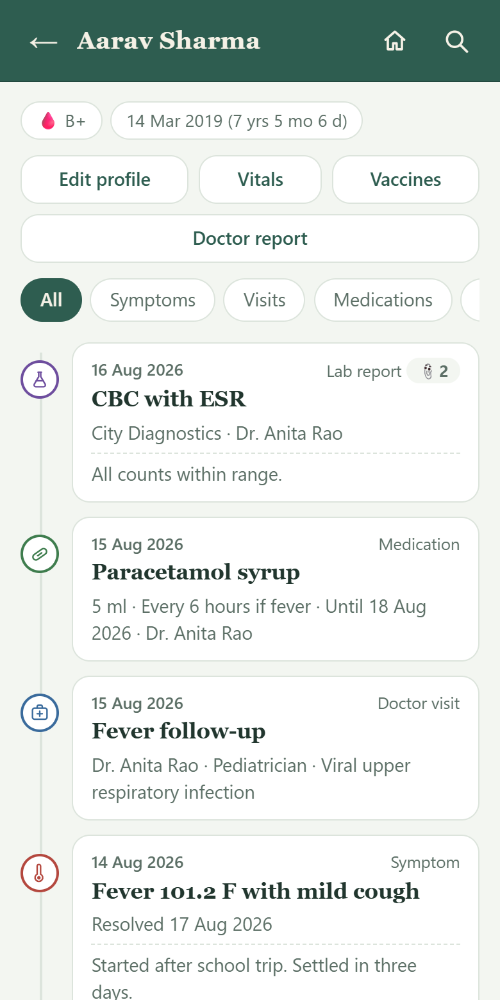
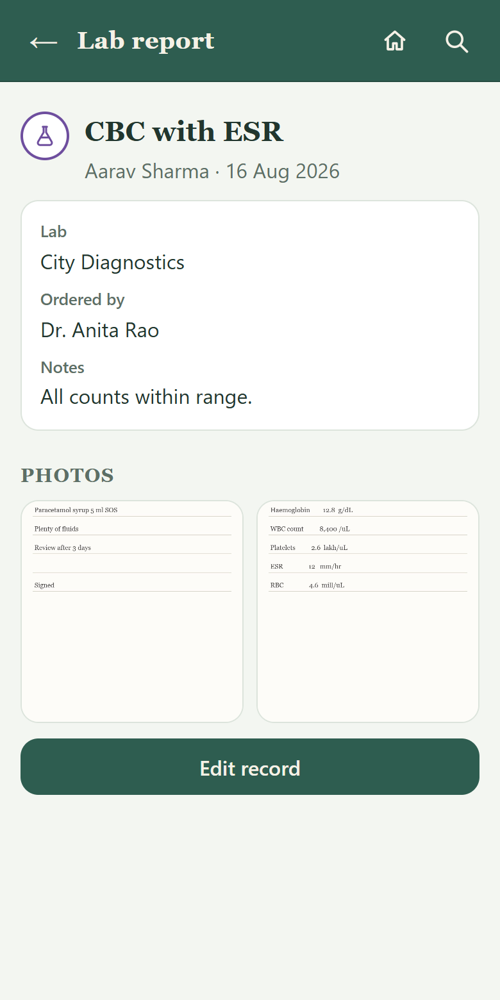
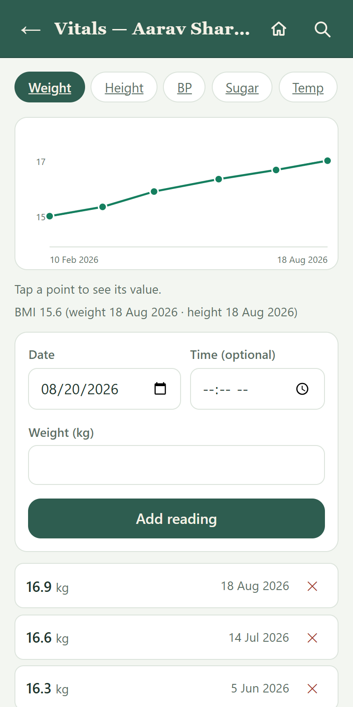
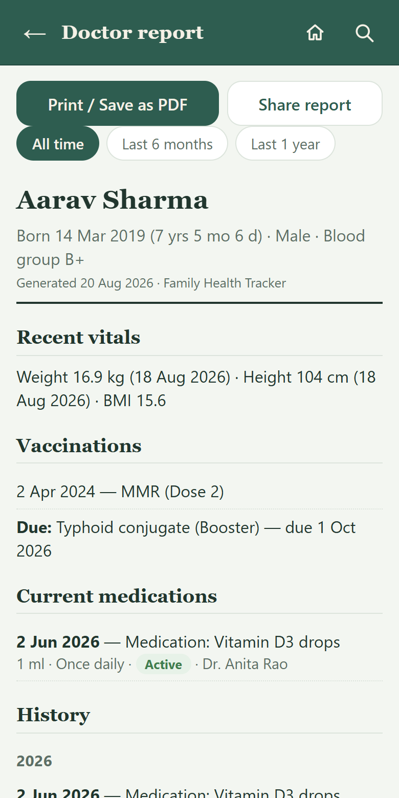
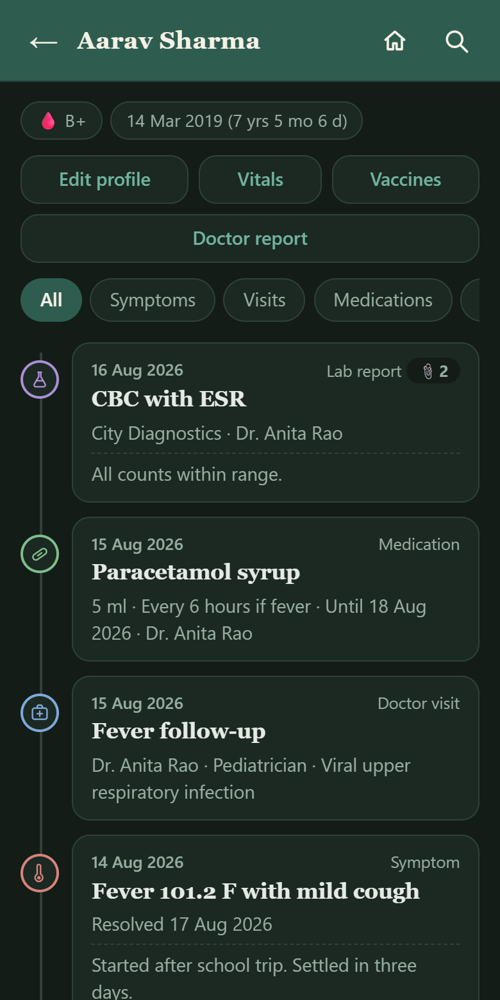

# Family Health Tracker

A private, installable health diary for your family. Track symptoms, doctor visits, medicines, lab reports, vitals and vaccinations for every family member — from a single app that lives on your phone.

**Everything stays on your device.** There is no backend, no account and no analytics. Records are stored in your browser's local database (IndexedDB); the hosted site only delivers the app shell. Built with plain HTML, CSS and JavaScript — no build step, no dependencies.

## Screenshots

<table>
  <tr>
    <td align="center"><br><sub>Family at a glance</sub></td>
    <td align="center"><br><sub>Per-person timeline</sub></td>
    <td align="center"><br><sub>Records with attachments</sub></td>
  </tr>
  <tr>
    <td align="center"><br><sub>Vitals with trend charts</sub></td>
    <td align="center"><br><sub>Printable doctor report</sub></td>
    <td align="center"><br><sub>Dark mode</sub></td>
  </tr>
</table>

## Features

- **Health timeline per person** — symptoms and illnesses, doctor visits, medications and lab reports, newest first, with type filters.
- **Attachments** — add photos and PDFs (prescriptions, lab reports) to any record. Photos are compressed on-device and open in a full-screen viewer with swipe and arrow-key navigation; PDFs (up to 10 MB) open in your PDF viewer.
- **Vitals** — weight, height (with BMI), blood pressure, blood sugar and temperature, each with a trend chart. Temperature readings can note the medicine given.
- **Vaccinations** — each person's list of given, due and overdue vaccines.
- **Doctor report** — a clean, printable summary per person (recent vitals, vaccinations, current medications, history) with a date-range filter. Print it, save it as a PDF, or share it as text.
- **Search** — one search box across everyone's records: medicines, symptoms, doctors, diagnoses, labs and notes.
- **Backup and restore** — export all data (attachments included) as a single JSON file and import it on any device, with merge or replace.
- **Offline-first** — works with no connection once installed. Dark mode follows your phone's setting.

## Install on your phone

The app is a Progressive Web App (PWA): you install it from the browser, after which it launches full-screen from its own icon and works offline.

### Android (Chrome)

1. Open the app's URL in Chrome.
2. Tap the three-dot menu in the top-right corner.
3. Tap **Add to Home screen** (on newer Chrome versions: **Install app**), then confirm.
4. The app appears on your home screen and app drawer. Launch it from there — it opens full-screen without browser controls.

Chrome may also show an install banner at the bottom of the page on your first visit; tapping that does the same thing.

### iPhone / iPad (Safari)

1. Open the app's URL in Safari. (Installation only works from Safari, not Chrome or other browsers on iOS.)
2. Tap the **Share** button (the square with an upward arrow) in the toolbar.
3. Scroll down and tap **Add to Home Screen**.
4. Tap **Add**. The app appears on your home screen and launches full-screen.

### After installing

- Updates are picked up automatically: within about ten minutes of a new deploy, the app fetches the new version and applies it the next time you launch it.
- Your data is stored by the browser on the device. Do not clear the browser's site data for the app's domain — that deletes your records. Export a backup regularly (see below).

## Backup and restore

Because data never leaves your device, the backup file is your only safety net if the phone is lost, broken or reset.

- **Save backup file** downloads a JSON file containing every member, record, vital, vaccine and attachment. Attachments are embedded, so backups with many photos get large.
- **Share backup** hands the same file to your phone's share sheet — the quickest way to push it to Google Drive, email or another device.
- **Import backup** reads a backup file (it can pick the file straight from Google Drive on Android) and offers two modes: **merge** with the current data or **replace** everything.

A nudge on the home screen shows how long it has been since your last backup.

## Run locally

No build step — any static file server works:

```
python -m http.server 8000
# then open http://localhost:8000
```

## Deploy (GitHub Pages)

Push to `main` with Pages enabled (Settings > Pages > Deploy from branch > `main` / root).

> **Before every deploy: bump the `CACHE` version string at the top of `sw.js`** (for example `fht-v8` to `fht-v9`). If you forget, phones keep serving the old cached version. Updates reach installed apps within about ten minutes and apply on the next launch.

## How it is built

Plain ES modules, one file per concern, served as-is:

| File | Responsibility |
| --- | --- |
| `index.html` | App shell: top bar and the `#app` container |
| `js/app.js` | Hash router, top-bar wiring, service worker registration |
| `js/views.js` | Screens: home, member timeline, record form, search, doctor report |
| `js/detail.js` | Read-only record view |
| `js/vitals.js` | Vitals tabs, SVG trend charts, readings |
| `js/vaccines.js` | Vaccination list per member |
| `js/photos.js` | Attachment compression, storage, picker and full-screen viewer |
| `js/backup.js` | JSON export/import of all data |
| `js/db.js` | Promisified IndexedDB wrapper and domain queries |
| `js/fmt.js` | Shared escaping, date formatting and record-type metadata |
| `sw.js` | Cache-first service worker for offline use |

Records, vitals, vaccines and attachments live in IndexedDB stores keyed by member. All user strings are HTML-escaped at render time. The service worker precaches the shell, so the app opens instantly and fully offline; only a new cache version triggers a refetch.

## License

[MIT](LICENSE)
